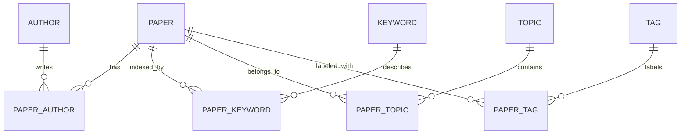

# 数据库第一版设计

五个核心实体为 `paper`、`author`、`keyword`、`topic`、`tag`，关系由 `paper_author`、`paper_keyword`、`paper_topic`、`paper_tag` 表达。

## 关键约束

- PMID、规范化 DOI、来源记录 ID 为强去重键。
- 无强标识符时，对规范化标题、年份、第一作者生成 SHA-256 指纹。
- 标题与摘要使用 PostgreSQL `tsvector` 和 GIN 索引；年份使用普通索引。
- 作者单位记录在 `paper_author`，因为同一作者在不同论文中的单位可能变化。
- 关键词区分作者词、MeSH 和自动抽取词；专题可保存检索表达式，标签用于人工整理。
- 原始记录保存在 `raw_payload`，便于纠错和重新解析。

完整建表脚本见 [`database/schema.sql`](../database/schema.sql)。收藏、备注与用户表在身份模型确定后加入。
