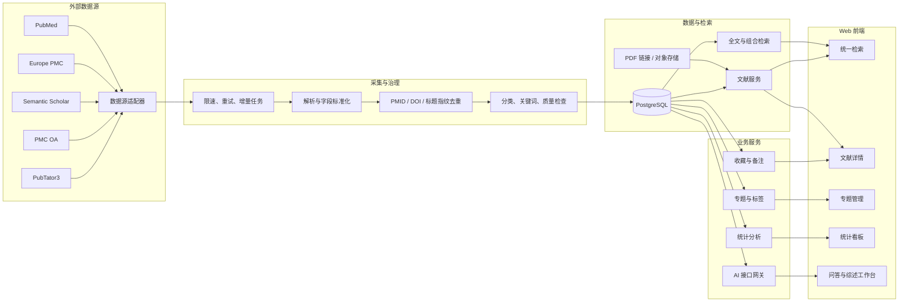

# 功能模块图

```mermaid
flowchart LR
    subgraph S[外部数据源]
      P[PubMed] --> A[数据源适配器]
      E[Europe PMC] --> A
      SS[Semantic Scholar] --> A
      OA[PMC OA] --> A
      PT[PubTator3] --> A
    end
    subgraph C[采集与治理]
      A --> R[限速、重试、增量任务]
      R --> N[解析与字段标准化]
      N --> D[PMID / DOI / 标题指纹去重]
      D --> Q[分类、关键词、质量检查]
    end
    subgraph DS[数据与检索]
      Q --> PG[(PostgreSQL)]
      PG --> FT[全文与组合检索]
      PDF[PDF 链接 / 对象存储] --> API
    end
    subgraph B[业务服务]
      PG --> API[文献服务]
      PG --> TOP[专题与标签]
      PG --> COL[收藏与备注]
      PG --> STA[统计分析]
      PG --> AI[AI 接口网关]
    end
    subgraph U[Web 前端]
      FT --> UI[统一检索]
      API --> UI
      API --> DETAIL[文献详情]
      TOP --> TUI[专题管理]
      COL --> DETAIL
      STA --> DASH[统计看板]
      AI --> WORK[问答与综述工作台]
    end
```

采集器与业务 API 分离；PostgreSQL 是首版事实数据源。AI 模块只通过受控接口读取数据，生成结果必须保留 PMID、DOI 等来源引用。
